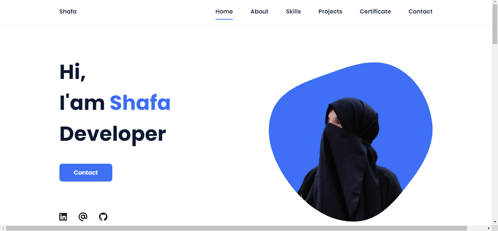

# Personal Portfolio


Welcome to my personal portfolio repository! This repository contains the source code for my personal portfolio website, showcasing my skills, projects, and experiences in web development.

### Table of Contents
- About
- Features
- Technologies Used
- Getting Started
- Usage

### About
My personal portfolio website is a showcase of my skills and projects in web development. Designed and developed using HTML, CSS, and JavaScript, this website serves as a digital resume and portfolio to highlight my expertise and accomplishments.

### Features
* <b>Responsive Design:</b> The website is fully responsive, ensuring seamless user experience across various devices and screen sizes.
* <b>Portfolio Section:</b> Showcase a curated selection of my projects with descriptions, technologies used, and links to live demos and GitHub repositories.
* <b>About Me:</b> Provide insights into my background, education, professional experience, and personal interests.
* <b>Social Media Integration:</b> Links to my social media profiles for easy connection.

### Technologies Used
- HTML
- CSS
- JavaScript

### Getting Started

1. To get a copy of this project up and running on your local machine, follow these steps:
   
    Clone the repository:
    ```bash
    git clone https://github.com/your-username/personal-portfolio.git

3. Open the project folder in your code editor.

4. Open the index.html file in your web browser to view the website locally.

### Usage
 Feel free to explore the code, customize the design, and add your own projects to the portfolio section. If you'd like to use this portfolio template for your own website, simply fork the repository and modify it according to your preferences.
